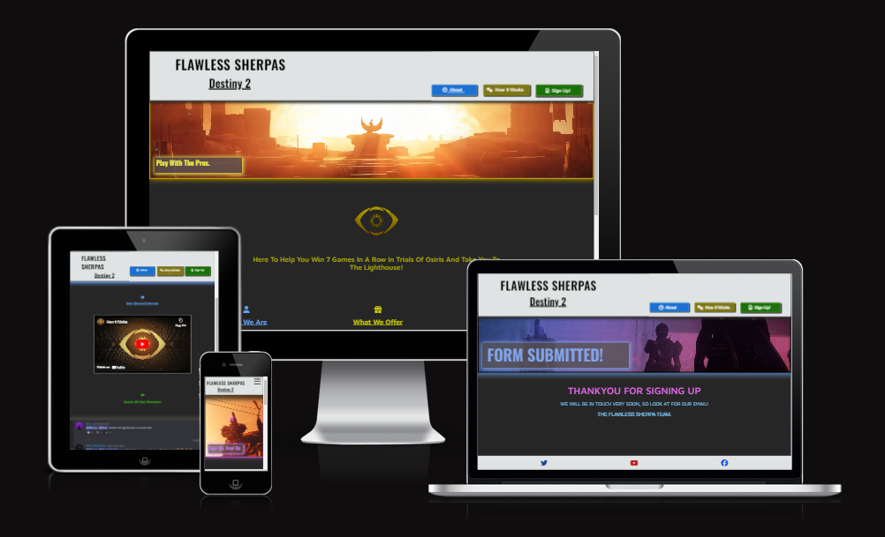
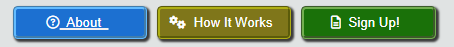
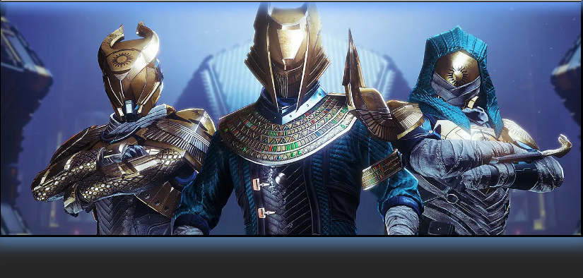
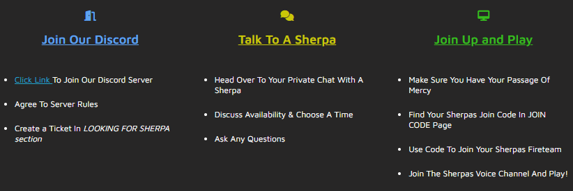
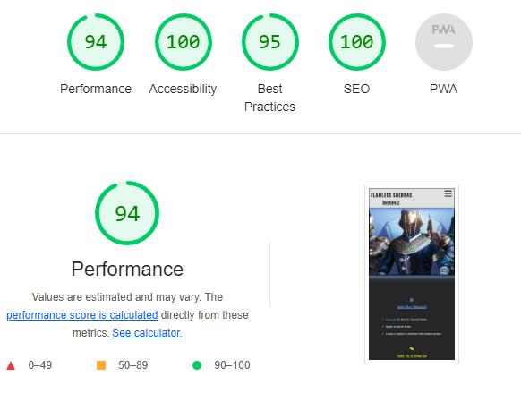

# **Flawless Sherpas**

## **Site Overview**

The Flawless Sherpas website is designed for players of the video game destiny 2, where they can seek out assistance in the most competitve game mode in the game - Trials Of Osiris. Where only a very small percentage of players will go "flawless", the flawless sherpas offer their services to take people though the struggle of the game mode and take them flawless! The businesses main platform is on discord and so this is linked in all three pages on the website, making it easy to find and access.

Users of the website will be able to find all the information they need, being - who the flawless sherpas are, how the service works and the price of the service. there is also a video on how the service works, making it an extra visual learning form for the user. A screen shot of some reviews also backs up the quality of the service. There is also a sign up form for users that do not have discord, so that the website can reach all of the targeted audience.

## **Planning**

### **Target Audience**

- Users that play the game destiny 2
- Users that play destiny 2 and struggle to get the desired loot in the game mode "trials of osiris"
- Users who want to improve as players by looking for tips and advice from successful gamers

### **User Questioning**

- Users want a brief description of how the service works and an easy to find the link to the discord
- Users want to know what the service costs
- Users that don't have Discord want a way to sign up for the service
- Users want to see reviews to feel confident in the service
- Users want to see a video of the discord and how to navigate it

### **Websites Aim**

- Provide information about what the business offers, cost of service and easy access to businesses main working platfrom - discord
- Ensure the user can navigate easily around the page, to find what they want
- Ensure information is short and to the point making it easy to digest for the user
- Provide user with both written explanation and visual explanation of how service works
- Provide a contact point for people without discord to maximise customers for business
- Provide the business more exposure to potential customers
- Be designed to create a positive user experience on all devices, including mobile and up to desktop.

### **How Will This Be Achieved**

- The site will contain a navbar in the header, where users can navigate easily to the different pages of the site
  being -

- The home page - which will provide a breif sumamry of what the website is and what the business provides, which will
  be located at the start of the page. This page will sumarise who the business is, what they do and the cost of the service. Also, a link
  to the discord server will be provided.
- The How It Works page - which will provide a more detailed explanation about the steps to follow, to use the service.
  This will be both written and visual explantion in the form of bullet points and youtube video. There will also be a reviews section and a
  second link to the discord server.
- The sign up page - which will provide users that do not have discord or have any other questions, a form to fill out, so the business can
  contact them and discuss how to help them. This page will also have a link to the discord server. The form must have feedback to the user that they have submitted their form.

- The website will be a responsive design for different devices, starting from mobile and up to desktop.

## **Wireframes**

To put ideas into reality and play around with how the website will work and look, i started using wireframes to plan out the website layout and content. This would also help me avoid scope creep.
Below are the wireframes for the 3 intended pages for desktop.

I started the wireframe design for desktop in this project and would have started for mobile and then done desktop if i was to do it again, as i coded for mobile design first and then added the response design after.

There was also some changes to the final design being -

- I did not include an embeded scrollable reviews page, as doing rearch on doing this with discord, i found that i needed to use a bot and python, which was out of my scope at the time. Instead i added 3 screenshots of reviews and will replace this will a scrollable page in the future.
- I added text to the sign up form, of why it is there and for who, for clarity.
- I changed the hero images to be more relevent to the content and look better when on wider screens.
- I added cover text to hero images, for more effect and positive emotional response from user.
- I added box-shadow effects to the hero images, header and sign up form, to stand out more.
- I also had to adjust the layout for mobile users, including a burger bar button for a drop down menu of the navbar.
- i changed the color of the how it works button and red list headers, for accessability reasons.

## **Features**

#### **Navigation:**

- The navigation buttons appear on the header, on all 4 pages, including the form feedback page, making it an easy way to navigate throughout the website and allowing the user to find what they want fast.
- The nav buttons include the about page, how it works page and the sign up page.
- The nav buttons are all coloured different, on a grey header, to make them easy to spot.
- They also have relevent icons for better asthetic design and better UX.
- The nav buttons have a hover feature, giving the user feedback when they hover over each of the nav buttons showing them they can select the page.
- The buttons also show the user which page they are on, by an underline of the pages button.
- The nav bar becomes a drop down menu for mobile users by using a burger bar.

---

#### **Header**

- The header sticks to the top of all pages on the website and so as the user scrolls up and down, the header will remain fixed and move with the flow of the page. This creates a good UX as the user can find the navigation bar easy and all times.
- It includes the title of the page, which also acts as a internal link to the home page - about.
- It also homes the navigation buttons which are located in the bottom right hand side of the header, and more mobile users, this will turn into a dropdown menu in the form of a burger bar found on the right hand side of the header.
- It has a black solid border with box shadow effect to stand out.

 

## **About Page**

The About page first contains a hero image, being of in game cosmetics of the game mode the site is about. It has brief desciption of what the websites purpose is and what the business if offering, which is also seen by the user imediatly on site open. It is summed up in one line, and made big and is in the centre of the page. It is styled in the yellow colour of the game mode and is next to the game modes logo.
It also contains,

- 3 bullet pointed lists, all with coloured headers, matching the color order of the navigation bars. The information provided is what is most important to the user and summed up in an easy digested list, getting straight to the point. This being, who we are, what we offer and the price.
- It also includes a link to the businesses main platform, discord, with an icon of discords logo and text for the user to select to take them to the website, which will open in a new tab. The link has a hover feature, where the color of the links text will change to green, when the user hovers over it, showing them they can click it and green being a positive color.

## **How It Works Page**

The How It Works page contains an explanation of how the service works and steps to take to navigate the businesses operating platfrom - discord, summarised in short bullet pointed lists. Following the same consistant style of 3 lists, with the same colour headers as the previous page and nav buttons, each with a relevent icon.
It also contains,

- An embeded youtube video, explaining how the service works, that can be played by selecting the play button and can be full screened for a better viewing experience. This adds an extra way for users to recieve the information, that some people may find easier to digest.
- 3 screenshots of reviews from the businesses discord server, showing that the service holds value and is worth doing. This was orginally meant to be a scrollable page of entire review section of discord, but ended up being out of my scope at the time and will be updated in the future.
- It has another hero image of game mode the website is about.
- It also contains a second link to the discord server.

## **Sign Up Page**

The Sign up page has a form to collect details from users that want to use the service that dont have discord or have any other questions.
It also has,

- A submit button for the form, which has a hover feature that turns the button green when the mouse hovers over it. Green being a positive color.
- The form cannot be submitted until the required information is put in the input boxes, being text and email.
- A link to the discord server
- an explantion that you can still use the service without discord, by filling out the form.
- A form feedback page, that you are taken to on completion and submition of the form. This is a placeholder and will be updated in the future.It gives confirmation to the user that they have completed the form correctly and are told that they will be contacted soon.
- A color scheme that matches the hero image creating a astheticly pleasing page.
- The form has a box shadow effect that makes it stand out.

### **Form Feedback Page**

## **Footer**

The footer contains 3 links that open in a different browser, these being, the buisnesses twitter page, youtube page and facebook page.
They are evenly spaced along the header using a spacing on 20% each. The footer apears on all pages and allows the user to do more research and contact the business.

## **Testing**

## **During Devlopment Testing**

- During the devlopment stages, i would regularly test each element for appearance and responsiveness via a simulated live server using an extension in codeanywhere.
- I published the page to GITHUB pages and let people in the businesses discord, review and test the site, using different devices and browsers. All feedback was positive.
- I tested the site myself, using different browsers: google chrome, firefox and edge, to ensure the site works well on different browsers.
- To test the responsiveness of the site, i used devtools to simulate different screen sizes, to make sure the sites design is fit for all devices. I then would add media queries in the style.css file to improve the responsive design.
- I have made sure all links on the site will open in a new browser.
- I have confirmed that on completion of the form and submition, that the form feedback page will then appear.
- I have tested and made sure that the form cannot be submited unless all relevent, required data is put in the correct boxes - text for names and email for email address.
- I have tested that all hover features for links work.
- I have made sure the embeded video works and also doesnt play automatically when the page loads. It requires the user to select play first.

## **Bugs, Issues And Fixes**

To see how the site worked and if any bugs or issues were present, i deployed it in the early stage of development through github pages, as it can respond different to codeanywheres live server.

The issues i found during development include -

**_Burger bar location:_**

- **_Issue_**
  - the drop down menu burger bar, for the navigation bar, would not move to the right hand side of the header, no matter what i did. I wanted the two headers in rows and the nav bar on the right.

- **_Solution_**
  - I had to set header display to flex and justify content as space between. I had the headers wrapped in an anchor element and the nav bar in a nav element. From there i used padding to move the burger bar and title to where i wanted.

  **_Youtube video:_**

- **_Issue_**
  - The youtube video i put in the How It Works page was not working, with the url i copied from the browser.

- **_Solution_**
  - I googled the issue and found i had the use the unique link on the videos page to embed the video into the site.

  **_Scrollable reviews page:_**

- **_Issue_**
  - When trying to embed a scrollable reviews page from the businesses discord, every time i tried to do this i found that the website would load up a scrollable page of the discords join page, not the reviews page.

- **_Solution_**
  - I researched a way round this and found that the only way to display the page that i want is to use a bot and python language. As this was out of my scope at the time, i decided to use screenshots of the reviews page and will update it to the scrollable page in the future.

  **_List structure readability:_**

- **_Issue_**
  - I originally had the 3 lists on the first two pages in collumn form for all screen sizes. However, i found that when on mobile, the lists would appear squashed and difficult to read. This creates a bad user experience.

- **_Solution_**
  - I changed the lists layout to appear in rows on smaller screens and then change to collumn on larger screens using media queries. This made the content easier to read as it allowed me to increase font size.

  **_Hero image:_**

- **_Issue_**
  - the first hero image i added would load multiple copies of itself to fill the space of the screen. This didnt look good and i wanted just one large image across the full width.

- **_Solution_**
  - I set the images width to 100% and added no-repeat to the images style rule. This resulted in one wide picture of the hero image.

  **_Footer Icons:_**

- **_Issue_**
  - I spent some time trying to space the icons in the footer evenly with padding for different screen sizes and wasted alot of time.

- **_Solution_**
  - By setting the footers display to flex and justify content space between, this made sure the icons would appear evenly seperated on every screen size. I played arround with the padding with pixles but then found if i used percentage, it would result in consistant spacing across all screen sizes, saving time working out padding for each screen size using pixles.

  **_Link to other sites:_**

- **_Issue_**
  - When i first embeded a link to discord, it would open in the same browser, taking me out of the website. This resulting in poor user experience.

- **_Solution_**
  - I added the rule in the anchor element, target=\_blank. This resulted in the link opening up in a different browser when clicked.

**_Git commits issue:_**

Another issue i found was that during the early stages of development, i would forget, or not be as consistant with my git commits. This resulted in my commits containing too much various changes and so difficult to sum up in a message. As the development went on i improved on this, making it easier to understand what had changed, if i had to go back and do bug finding or fixes. I also adjusted my commit messages from past tense to present.

### **Remaining bugs and issues**

- During the lighthouse test of the How it works page, a note was flagged up linked to the embeded youtube video. This noted that - Pages that use Media Device Dispatcher are not eligible for back/forward cache and that it was pending browser support.
- Also, another point was flagged linked to the video and images - Serve static assets with an efficient cache policy.

As i have not yet learnt about caches, a code institute tutor explained - that this is not covered and actually an advanced topic that you would learn in your developer career rather than on a coding course. I would like to revist this in the furture and fix the issue.

## **Post Development Testing**

### **Validators**

#### **_Html -_** <https://validator.w3.org/n>

- **_Issue_**
  - The navigation buttons i used were originally inside of an anchor element, which the validator displayed as a problem.
- **_Solution_**

  - I wrapped the buttons in seperate form elements, which fixed the issue.

- **_Issue_**
  - I used a less than sign in the HTML code for a text paragraph, which caused a number of errors.
- **_solution_**

  - I changed the sign in the HTML to text code, which i found on google, which displays the sign on the deployed site.

- **_Issue_**
  - I used line brakes in the HTML code, to add space between the list bullet points. This created errors in the code validator.
- **_Solution_**

  - I removed the line brakes in the HTML and added padding to the lists in the style sheet.

- **_Issue_**
  - Not enough header elements on the page.
- **_Solution_**
  - Added extra header elements to sections that were missing them, and where i didnt want them to show on the site, i set there display to none.

#### **_CSS -_** <https://jigsaw.w3.org/css-validator/>

- All pages pased the css code validator with no errors or issues found.

## **_Lighthouse scores_**

The two areas i had to work on to recieve these scores were,

- color contrast - to improve the accessability, i adjusted the color brightness of the blue and green headers on the pages and changed the color of the red headers to yellow.
- Image file size - The load times for the page were slower than could have been initially, and so to improve the performance of the site, i used a third party website to optimise the imgages as much as i could. I was able to reduce the image file sizes an average of around 75% which bumped up the sites performance score.

 
 
 
 

## **_Deployment_**

I deployed the site on GitHub pages, following these steps -

- In the project's repository in Github, go to the Settings tab.
- Select the Pages tab, from the left hand side.
- Under the Source section, select the Main branch from the drop-down menu and click Save.
- From this, the page will provide a link to the live website.

This being - <https://jordzen.github.io/Flawless-Sherpas/>

## **_Credits_**

#### **_Content:_**

- The code used to create the navigation drop down menu was used from code institutes project LOVE RUNNING.
- I tried avoiding using similar code in my project with that of the love running project as much as i could, but there may be some similarities in parts.
- All fonts were imported using Google Fonts. <https://fonts.google.com/>
- All icons were imported using Font Awesome. <https://fontawesome.com/>
- How it works video was embeded from youtube. <https://www.youtube.com/>
- Review screenshots were used from discord. <https://discord.com/>
- HTML code validator <https://validator.w3.org/>
- CSS code validator <https://jigsaw.w3.org/css-validator/>

#### **_Media:_**

- All images on the website were taken from and credit to Bungie inc. <https://www.bungie.net/7>
- The wireframes used for this project were made on Balsamiq <https://balsamiq.com/>
- The responsive device screenshot was taken from Am i Responsive. <https://amiresponsive.co.uk/>

#### **_Honarable Mention_**

A big thankyou to my code institute mentor David Bowers, who has used his valuable time to help guide me through this project and give me amazing advice.
And also a thankyou to the flawless sherpa team that helped me design this website with important feedback through the discord users and members.
And to big brother Jake for the advice.
