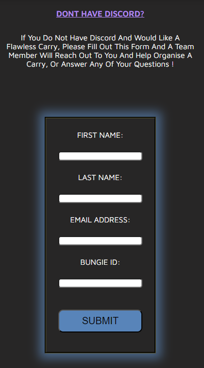

# **Flawless Sherpas**

## **Site Overview**

The Flawless Sherpas website is designed for players of the video game destiny 2, where they can seek out assistance in the most competitve game mode in the game - Trials Of Osiris. Where only a very small percentage of players will go "flawless", the flawless sherpas offer their services to take people though the struggle of the game mode and take them flawless! The businesses main platform is on discord and so this is linked in all three pages on the website, making it easy to find and access.

Users of the website will be able to find all the information they need, being - who the flawless sherpas are, how the service works and the price of the service. there is also a video on how the service works, making it an extra visual learning form for the user. A screen shot of some reviews also backs up the quality of the service. There is also a sign up form for users that do not have discord, so that the website can reach all of the targeted audience.

## **Planning**

### **Target Audience**

- users that play the game destiny 2
- users that play destiny 2 and struggle to get the desired loot in the game mode "trials of osiris"
- users that want to improve as players by looking for tips and advice by succesful gamers

### **User Questioning**

- users want a brief description of how the service works and a easy to find link to the discord
- users want to know what the service costs
- users that dont have discord want a way to sign up for the service
- users want to see reviews to feel for confident in the service
- users want to see a video of the discord and how to navigate it

### **Websites Aim**

- Provide information about what the business offers, cost of service and easy access to businesses main working platfrom - discord
- Ensure the user can navigate easily around the page, to find what they want
- ensure information is short and to the point making it easy to digest for the user
- provide user with both written explanation and visual explanation of how service works
- provide a contact point for people without discord to maximise customers for business
- provide the business more exposure to potential customers
- Be designed to create a positive user experience on all devices, including mobile and up to desktop.

### **How Will This Be Achieved**

- The site will contain a navbar in the header, where users can navigate easily to the different pages of the site
  being -

- The home page - which will provide a breif sumamry of what the website is and what the business provides, which will
  be located at the start of the page. This page will sumarise who the business is, what they do and the cost of the service. Also, a link
  to the discord server will be provided.
- the How It Works page - which will provide a more detailed explanation about the steps to follow, to use the service.
  This will be both written and visual explantion in the form of bullet points and youtube video. There will also be a reviews section and a
  second link to the discord server.
- The sign up page - which will provide users that do not have discord or have any other questions, a form to fill out, so the business can
  contact them and discuss how to help them. This page will also have a link to the discord server. The form must have feedback to the user that they have submitted their form.

- The website will be a responsive design for different devices, starting from mobile and up to desktop.

## **Wireframes**

To put ideas into reality and play around with how the website will work and look, i started using wireframes to plan out the website layout and content. This would also help me avoid scope creep.
Below are the wireframes for the 3 intended pages for desktop.

I started the wireframe design for desktop in this project and would have started for mobile and then done desktop if i was to do it again, as i coded for mobile design first and then added the response design after.  

There was also some changes to the final design being -

- I did not include an embeded scrollable reviews page, as doing rearch on doing this with discord, i found that i needed to use a bot and python, which was out of my scope at the time. Instead i added 3 screenshots of reviews and will replace this will a scrollable page in the future.  
- I added text to the sign up form, of why it is there and for who, for clarity.
- I changed the hero images to be more relevent to the content and look better when on wider screens.
- I added cover text to hero images, for more effect and positive emotional response from user.
- I added box-shadow effects to the hero images, header and sign up form, to stand out more.
- I also had to adjust the layout for mobile users, including a burger bar button for a drop down menu of the navbar.
- i changed the color of the how it works button and red list headers, for accessability reasons.

## **Features**

#### **Navigation:**

- The navigation buttons appear on the header, on all 4 pages, including the form feedback page, making it an easy way to navigate throughout the website and allowing the user to find what they want fast.
- the nav buttons include the about page, how it works page and the sign up page.
- the nav buttons are all coloured different, on a grey header, to make them easy to spot.
- they also have relevent icons for better asthetic design and better UX.
- the nav buttons have a hover feature, giving the user feedback when they hover over each of the nav buttons showing them they can select the page.
- the buttons also show the user which page they are on, by an underline of the pages button.
- The nav bar becomes a drop down menu for mobile users by using a burger bar.

***

#### **Header**

- The header sticks to the top of all pages on the website and so as the user scrolls up and down, the header will remain fixed and move with the flow of the page. This creates a good UX as the user can find the navigation bar easy and all times.
- it includes the title of the page, which also acts as a internal link to the home page - about.
- it also homes the navigation buttons which are located in the bottom right hand side of the header, and more mobile users, this will turn into a dropdown menu in the form of a burger bar found on the right hand side of the header.
- It has a black solid border with box shadow effect to stand out.

   

## **About Page**

The About page first contains a hero image, being of in game cosmetics of the game mode the site is about. It has brief desciption of what the websites purpose is and what the business if offering, which is also seen by the user imediatly on site open. It is summed up in one line, and made big and is in the centre of the page. It is styled in the yellow colour of the game mode and is next to the game modes logo.
It also contains,

- 3 bullet pointed lists, all with coloured headers, matching the color order of the navigation bars. The information provided is what is most important to the user and summed up in an easy digested list, getting straight to the point. This being, who we are, what we offer and the price.
- It also includes a link to the businesses main platform, discord, with an icon of discords logo and text for the user to select to take them to the website, which will open in a new tab. The link has a hover feature, where the color of the links text will change to green, when the user hovers over it, showing them they can click it and green being a positive color.

## **How It Works Page**

The How It Works page contains an explanation of how the service works and steps to take to navigate the businesses operating platfrom - discord, summarised in short bullet pointed lists. Following the same consistant style of 3 lists, with the same colour headers as the previous page and nav buttons, each with a relevent icon.
It also contains,

- an embeded youtube video, explaining how the service works, that can be played by selecting the play button and can be full screened for a better viewing experience. This adds an extra way for users to recieve the information, that some people may find easier to digest.
- 3 screenshots of reviews from the businesses discord server, showing that the service holds value and is worth doing. This was orginally meant to be a scrollable page of entire review section of discord, but ended up being out of my scope at the time and will be updated in the future.
- It has another hero image of game mode the website is about.
- It also contains a second link to the discord server.

## **Sign Up Page**

The Sign up page has a form to collect details from users that want to use the service that dont have discord or have any other questions.
It also has,

- A submit button for the form, which has a hover feature that turns the button green when the mouse hovers over it. Green being a positive color.
- The form cannot be submitted until the required information is put in the input boxes, being text and email.
- A link to the discord server
- an explantion that you can still use the service without discord, by filling out the form.
- a form feedback page, that you are taken to on completion and submition of the form. This is a placeholder and will be updated in the future.It gives confirmation to the user that they have completed the form correctly and are told that they will be contacted soon.
- a color scheme that matches the hero image creating a astheticly pleasing page.
- The form has a box shadow effect that makes it stand out.

#### **Form Feedback Page**

## **Footer**

The footer contains 3 links that open in a different browser, these being, the buisnesses twitter page, youtube page and facebook page.
They are evenly spaced along the header using a spacing on 20% each. The footer apears on all pages and allows the user to do more research and contact the business.

## **Testing**
